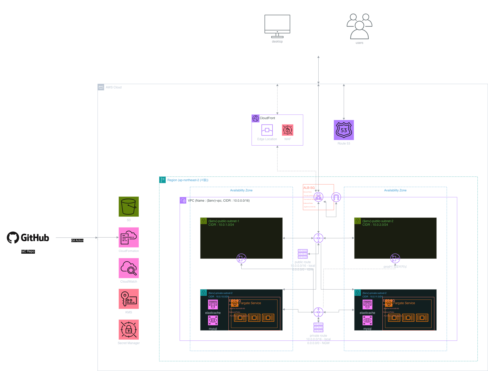

## 🔐 Secure Cloud Infra Automation – CTFd on AWS

이 저장소는 **KT Cloud Tech Up 사이버 보안 과정 1기 – Team Flag** 프로젝트로,  
CTFd(Capture The Flag 플랫폼)을 AWS 상에서 **보안 우선(least-privilege, 암호화 기본값)** 으로 배포하기 위한 인프라 코드(IaC) 구성입니다.  
모든 인프라는 **CloudFormation 템플릿 + GitHub Actions(OIDC 기반 GitOps)** 로 관리되며, 네트워크부터 애플리케이션 계층까지를 코드로 정의합니다.

---

## 🎯 프로젝트 개요

- **팀명**: Flag  
- **팀원**: 정민욱(팀장), 이영원(인프라), 최민재(시나리오/모의해킹)
- **기간**: 2025년 11월 ~ 2025년 12월 2일 (약 1개월)  
- **목표**
  - 최신 웹 보안 트렌드를 반영한 **실전형 CTF 실습 환경** 구축
  - Docker/CTFd + AWS 인프라를 활용한 **재현 가능하고 확장 가능한 실습 플랫폼** 제공
  - 모의해킹–복구까지 고려한 **엔드투엔드 보안 실습 인프라** 구현
- **핵심 성과물**
  - CTFd 기반 웹 플랫폼 + 여러 CTF 시나리오
  - Docker/Docker Compose 기반 CTF 환경
  - AWS CloudFormation 템플릿 및 GitHub Actions 배포 파이프라인

---

## 📦 핵심 특징

- **애플리케이션**: 공식 CTFd Docker 이미지 `ghcr.io/ctfd/ctfd:latest`
- **런타임**: ECS Fargate (서버리스 컨테이너, Private Subnet, Public IP 없음)
- **데이터 계층**: RDS MySQL(필수), ElastiCache Redis(세션/캐시), S3(파일 업로드)
- **보안/운영**:
  - KMS 기반 암호화, Secrets Manager 기반 시크릿 관리
  - 최소 권한 IAM 역할(Task Execution / Task Role 분리)
  - GitHub Actions OIDC + CloudFormation 기반 GitOps 배포
- **환경 분리**:
  - `dev` / `test` / `prod` 3개 환경
  - 템플릿은 공통 구조, 값은 `env/*.json` 으로 분리 관리

---

## 🏗 아키텍처 한눈에 보기

`docs/project01.drawio.png` 에 전체 인프라 아키텍처가 정리되어 있습니다.

- **요청 흐름**
  - 사용자 → ALB(2AZ, HTTPS 지원) → ECS Fargate(CTFd)
  - ECS → RDS MySQL (애플리케이션 데이터)
  - ECS → ElastiCache Redis (세션/캐시)
  - ECS → S3 (파일 업로드, 첨부 파일)
- **보안 리소스**
  - VPC + Public/Private Subnet, NAT Gateway (환경별 최적화)
  - Security Group(ALB/ECS/RDS/Redis), KMS, Secrets Manager
- **향후 확장**
  - ALB 앞에 Route53 + WAF + (선택) CloudFront 추가 가능하도록 설계

---

## 📂 리포지토리 구조

- **인프라 템플릿**
  - `cfn/bootstrap/`
    - `oidc.yaml`: GitHub Actions용 OIDC Provider + IAM Role
    - `s3.yaml`: CloudFormation artifacts용 S3 버킷 (환경별)
    - `kms.yaml`: 인프라 공용 KMS 키(`alias/${Env}-infra`)
  - `cfn/main/`
    - `network.yaml`: VPC, Subnets(2AZ), NAT, RouteTables
    - `security.yaml`: IAM Roles(Task Execution/Task), ALB/ECS Security Groups
    - `database.yaml`: RDS MySQL (CTFd 데이터베이스)
  - `redis.yaml`: ElastiCache Redis (세션/캐시)
    - `storage.yaml`: CTFd 업로드용 S3 버킷
    - `secrets.yaml`: CTFd 환경변수용 Secrets Manager(JSON 한 개)
    - `compute.yaml`: ALB, Target Group, Listener, ECS Cluster/Service/TaskDefinition
  - `root.yaml`: 위 스택들을 오케스트레이션하는 루트 스택
- **환경 파라미터**
  - `env/dev.json`, `env/test.json`, `env/prod.json`
  - 주요 필드: `Env`, `Region`, `AppName`, `AppPort`, `ImageUri`, `Cpu`, `Memory`, `DesiredCountStart/Stop`, `ExistingUploadBucketName`, `UseRedisTLS`, `AcmCertificateArn`
- **GitHub Actions**
  - `.github/workflows/bootstrap.yml`: Bootstrap 스택(S3, KMS)을 수동 배포
  - `.github/workflows/deploy.yml`: Main 스택 배포 + ECS 태스크 시작/중지/삭제
- **문서**
  - `plan.md`: 프로젝트 목표, 일정, 작업 전략(메타 플랜)
  - `tech.md`: 각 스택별 CloudFormation 명세, 보안/운영 설계, 참고 링크
  - `docs/project01.drawio.png`: 인프라 아키텍처 다이어그램

---

## 🧱 CloudFormation 스택 구성 요약

- **Bootstrap 스택 (`cfn/bootstrap/*.yaml`)**
  - 계정/환경 공통 리소스 (변경 빈도 낮고 재사용성 높음)
  - OIDC Provider + GitHubActionsDeployRole
  - CloudFormation artifacts S3 버킷
  - 인프라 공용 KMS 키(`alias/${Env}-infra`)
- **Main 스택 (`cfn/main/*.yaml`)**
  - **network.yaml**: 2AZ VPC, Public/Private Subnet, NAT(개발/테스트 1개, 프로덕션 2개), RouteTable
  - **security.yaml**: ECS Task Execution/Task Role, ALB/ECS Security Group
  - **database.yaml**: RDS MySQL 8.x, KMS 암호화, Multi-AZ(Prod), Snapshot 보존
  - **redis.yaml**: ElastiCache Redis 7.x, At-rest + Transit 암호화, Multi-AZ(Prod)
  - **storage.yaml**: CTFd 업로드용 S3 버킷(또는 기존 버킷 재사용), 퍼블릭 완전 차단
  - **secrets.yaml**: CTFd 환경변수(JSON) –  
    `SECRET_KEY`, `DATABASE_URL`, `REDIS_URL`, `AWS_S3_BUCKET`, `REVERSE_PROXY`, `UPLOAD_PROVIDER`
  - **compute.yaml**: ALB + Fargate Service + TaskDefinition(CTFd 전용 설정 포함)
  - **root.yaml**: Nested Stack 오케스트레이션
    - 배포 순서: Network → Security → Database/Redis/Storage → Secrets → Compute

---

## 🌱 환경 및 파라미터 관리

- **단일 소스**: 환경별 값은 모두 `env/${ENV}.json` 에서 관리합니다.
- **주요 필드 예시**
  - `Env`: `dev` / `test` / `prod`
  - `Region`: `ap-northeast-2`
  - `AppName`: `"ctfd"`
  - `AppPort`: `8000`
  - `ImageUri`: `"ghcr.io/ctfd/ctfd:latest"`
  - `Cpu`, `Memory`: CTFd 최소/권장 스펙(예: 512/1024 또는 1024/2048)
  - `DesiredCountStart`, `DesiredCountStop`: GitHub Actions `start/stop` 동작 시 사용할 태스크 수
  - `ExistingUploadBucketName`: 기존 S3 버킷 재사용 시 버킷 이름 (예: `"dev-ctfd-uploads-${ACCOUNT_ID}"`)
  - `UseRedisTLS`: `"true"` → `rediss://` 스킴 사용, `"false"` → `redis://`
  - `AcmCertificateArn`: ALB HTTPS 리스너용 ACM 인증서 ARN (미사용 시 빈 문자열)
- **설계 의도**
  - CloudFormation 템플릿은 **순수 구조**만 담고, 환경별 차이는 `env/` 에서만 관리
  - Git 히스토리로 파라미터 변경 이력 추적 가능

---

## 🧩 선행 준비 (최초 1회)

- **1. AWS 및 도구**
  - AWS 계정, AWS CLI, GitHub 리포지토리 준비
  - 배포 리전: `ap-northeast-2`
- **2. GitHub Secrets 설정**
  - 필수:
    - `ACCOUNT_ID`: AWS Account ID
    - `DB_PASSWORD_DEV`, `DB_PASSWORD_TEST`, `DB_PASSWORD_PROD`: 환경별 RDS 비밀번호
  - 선택:
    - `DB_USERNAME` (기본값 `ctfdadmin`)
    - `CTFD_SECRET_KEY` (없으면 워크플로에서 `openssl rand -hex 32` 로 생성)
- **3. OIDC Provider + GitHubActionsDeployRole 배포**
  - `cfn/bootstrap/oidc.yaml` 을 **로컬**에서 한 번만 CloudFormation으로 배포
  - GitHub Actions가 OIDC를 이용해 `GitHubActionsDeployRole` 을 Assume 하도록 설정
- **4. Bootstrap 스택 배포 (`bootstrap.yml`)**
  - GitHub → Actions → `Deploy Bootstrap Stack` 워크플로 실행
  - 입력:
    - `stack`: `s3` / `kms` / `all`
    - `env`: `dev` / `test` / `prod`
  - 결과:
    - 환경별 CloudFormation artifacts S3 버킷 생성
    - 환경별 인프라용 KMS 키(`alias/${Env}-infra`) 생성
- **5. `env/*.json` 작성**
  - `tech.md` 의 예시를 참고하여 `dev`, `test`, `prod` 각각에 대한 파라미터 파일 작성

---

## 🚀 배포 방법

### 1) Git Push 기반 자동 배포

- **트리거 조건**
  - 브랜치 이름 = 환경 이름 (`dev`, `test`, `prod`)
  - `cfn/main/**` 또는 `env/**` 변경 후 해당 브랜치에 push
- **동작**
  - `.github/workflows/deploy.yml` 실행
  - `env/${ENV}.json` 로드 → Bootstrap 스택 Outputs(S3, KMS) 조회
  - `cfn/main/root.yaml` 을 `aws cloudformation package` 로 S3에 업로드
  - `${ENV}-root` 스택을 `aws cloudformation deploy` 로 배포

### 2) GitHub Actions 수동 실행 (start/stop/delete)

- GitHub → Actions → `Deploy CloudFormation Stack`(`deploy.yml`) → `Run workflow`
- **입력값**
  - `env`: `dev` / `test` / `prod`
  - `action`:
    - `start`: `DesiredCountStart` 로 ECS 태스크 수 설정 (예: 2개)
    - `stop`: `DesiredCountStop`(보통 0) 으로 태스크 중지 (비용 절감)
    - `delete`: `${Env}-root` 스택 삭제 (Bootstrap 스택은 유지)

---

## 🔐 보안 설계 요약

- **네트워크**
  - VPC + 2AZ, Public Subnet(ALB/NAT), Private Subnet(ECS/RDS/Redis)
  - dev/test: NAT 1개(비용 최적화), prod: NAT 2개(각 AZ별, 고가용성)
- **Security Group**
  - ALB-SG:
    - Inbound: 80/443 from `0.0.0.0/0`
    - Outbound: ECS AppPort로만
  - ECS-SG:
    - Inbound: AppPort from ALB-SG만
    - Outbound: NAT/VPC Endpoint 경유(0.0.0.0/0)
    - RDS-SG: 3306 from ECS-SG만
    - Redis-SG: 6379 from ECS-SG만
- **암호화/시크릿**
  - RDS: KMS 기반 스토리지 암호화, 자동 백업 + Snapshot 보존
  - Redis: At-rest + Transit 암호화(`rediss://`), 세션/캐시 용도
  - S3: SSE-S3(AES256), 퍼블릭 접근 완전 차단, ECS Task Role로만 접근
  - Secrets Manager:
    - CTFd 필수 환경변수를 JSON 하나로 관리 (`SECRET_KEY`, `DATABASE_URL`, `REDIS_URL`, `AWS_S3_BUCKET`, `REVERSE_PROXY`, `UPLOAD_PROVIDER`)
    - ECS TaskDefinition 에서 `Secrets` 필드로만 주입 (하드코딩 금지)
- **CI/CD**
  - GitHub Actions OIDC + IAM Role, 장기 액세스 키 삭제
  - CloudFormation을 유일한 배포 경로로 사용 (Git = 단일 소스)

---

## 💾 백업·복구 개요

- **RDS MySQL**
  - dev/test: 자동 백업 1일, prod: 7일
  - 스택 삭제 시 `DeletionPolicy: Snapshot` 으로 최종 스냅샷 보존
  - 장애 시 새 인스턴스로 복원 후 Secrets 의 `DATABASE_URL` 만 새 Endpoint 로 교체
- **ElastiCache Redis**
  - dev/test: 단일 노드, prod: Multi-AZ + Automatic Failover
  - 세션/캐시 용도 → 심각 장애 시 새 Replication Group 생성 + `REDIS_URL` 교체
- **S3**
  - 기본 암호화(AES256), 퍼블릭 차단
  - 필요 시 버전 관리/라이프사이클/CRR 로 확장 가능

---

## 📚 참고 사항 (요약 설계 메모)

- **프로젝트 배경**
  - 이 인프라는 **KT Cloud Tech Up 사이버 보안 과정 1기** 교육 프로젝트로 설계되었습니다.
  - 목표는 교육/실습 환경이라도 가능하면 **실서비스 수준의 보안·운영 모범사례**를 따르는 것입니다.
- **설계 의도**
  - 모든 리소스를 CloudFormation으로 관리하고, GitHub Actions(OIDC)를 통해 Git 커밋이 곧 인프라 상태가 되도록 만들었습니다.
  - 네트워크·보안그룹·IAM·시크릿·로그·배포 플로우까지 “왜 이렇게 했는지”를 코드 구조와 이 README 안에서 최대한 드러내는 것을 목표로 했습니다.
- **운영 가정**
  - 주 용도는 교육 및 CTF 행사 운영이며, 상시 24시간 서비스보다는 **필요 시간대에만 ECS 태스크를 올렸다 내리는** 비용 최적화 전략을 가정합니다.
  - prod 환경으로 확장할 때는 NAT, RDS/Redis Multi-AZ, 모니터링/알람, WAF 등을 단계적으로 강화하는 것을 전제로 합니다.

---

## 🧪 프로젝트 한계와 향후 보완점

- **아직 구현되지 않은 부분**
  - WAF, GuardDuty, Security Hub, CloudTrail, AWS Config, 세부 CloudWatch Alarms 등은 설계 레벨에서만 고려되어 있고 실제 스택은 포함되지 않았습니다.
  - 애플리케이션(CTFd) 레벨의 보안 테스트 결과(예: 취약점 스캔, 부하 테스트)는 별도로 정리하지 못했고, 주로 인프라 설계에 초점을 맞췄습니다.
- **기술적 아쉬운 점**
  - 모든 인프라를 한 번에 올렸다 내리는 구조라, RDS/Redis/S3 등 **상시 유지가 필요한 리소스와 탄력적으로 조정할 리소스(CTFd 서비스)** 를 더 잘 분리하면 운영 비용과 유연성이 개선될 수 있습니다.
  - VPC Endpoint, VPC Flow Logs, 세분화된 IAM 정책 등은 문서화만 되어 있고, 실제 템플릿에 옵션 토글 형태로 충분히 녹여내지 못한 부분이 있습니다.
- **향후 개선 아이디어**
  - WAF + CloudFront + Route53 를 포함한 **프로덕션용 경계 보안 레이어**를 별도 스택으로 추가하고, 보안 이벤트에 대한 알람/Runbook까지 연결해 보고 싶습니다.
  - CTFd 애플리케이션 로그/메트릭(문제 풀이 시도, 제출 성공/실패, 관리자 액션 등)을 CloudWatch/외부 APM 에 통합해서 **운영/분석 관점**도 강화하는 것이 다음 단계 목표입니다.

